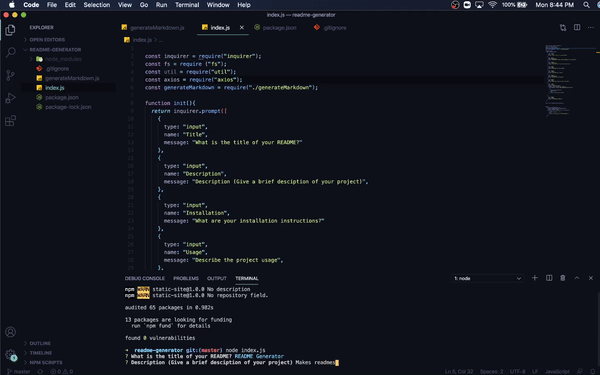

# Readme Generator Homework
This project uses node.js in the terminal to create a markdown file with a basic README template.
https://github.com/dantalmont/readme-generator
 
 

 
 
## Technologies
Node.js
Visual Studio Code
## Launch
Once node.js is installed, open terminal in the correct file path of the README Generator folder. RUN "npm install" to get all required dependencies. RUN "node index.js" then answer prompts to fill out each section of the README. Once completed a README.md file will be created.
